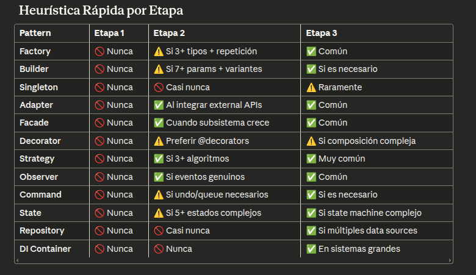

# 1. Workflow de desarrollo de software
Tú → Especificación clara → Agente propone arquitectura → 
TÚ APRUEBAS → Agente implementa módulo por módulo → 
TÚ REVISAS cada módulo → Siguiente módulo

# 2. Prompting más estricto
En lugar de "haz una API", algo como:

1. Lista los endpoints que necesito (espera aprobación)
2. Para cada endpoint, define el contrato (entrada/salida)
3. Implementa UNO, muéstrame el código completo
4. Espera mi OK antes del siguiente

# 3. Un simple orquestador que fuerce el workflow
1. Pide arquitectura en JSON estructurado
2. Itera: propone método → espera tu input → implementa
3. Guarda cada paso en archivos separados
4. Genera un log legible de TODO lo que pasó

CONTEXT: Estamos en fase de PROTOTIPADO. Prioridad absoluta: que funcione rápido.

REGLAS ESTRICTAS:
- Todo en 1-2 archivos máximo
- Zero abstracciones (nada de clases si una función sirve)
- Zero configuración (hardcodear está OK)
- Zero "qué pasaría si..." (solo el caso de uso inmediato)
- Comentarios solo si algo es raro

CRITERIO DE ÉXITO:
Puedo ejecutar esto y ver el resultado en menos de 5 minutos.

TAREA: [tu tarea específica]
```

**Señales de que estás listo para la siguiente etapa:**
- ✅ Has usado el prototipo 3+ veces
- ✅ Entiendes qué partes duelen/molestan
- ✅ Tienes 2+ casos de uso reales (no hipotéticos)

### ETAPA 2: Structuring (Días 4-10)
**Objetivo**: Hacer el código mantenible

**Prompt para Claude Code:**
```
CONTEXT: Tenemos un prototipo funcional. Ahora necesitamos estructura para mantenerlo.

DOLOR ACTUAL QUE TENGO:
[Describe específicamente qué te duele: "tengo que cambiar 3 lugares cuando modifico X", "no puedo testear Y porque está acoplado a Z", etc.]

REGLAS:
- Añade SOLO la estructura que resuelve el dolor específico que listé arriba
- Pregúntame antes de crear: interfaces, clases base, factory patterns, layers
- Máximo 5 archivos por módulo
- Cada abstracción debe tener 2+ implementaciones REALES o ser absolutamente necesaria para testing

PROHIBIDO:
- "Preparar para el futuro"
- "Esto podría ser útil si..."
- Patrones de diseño sin justificación concreta

TAREA: [refactor específico]
```

**Señales de que estás listo para la siguiente etapa:**
- ✅ El código está en producción o uso real
- ✅ Tienes usuarios/casos de uso diversos
- ✅ Aparecen patrones claros de extensión necesaria

### ETAPA 3: Scaling (Semanas 2+)
**Objetivo**: Preparar para crecimiento real

**Prompt para Claude Code:**
```
CONTEXT: Sistema en producción con [N] usuarios/casos de uso. Necesitamos escalar.

EVIDENCIA DE NECESIDAD:
[Lista problemas REALES que tienes: "5 clientes pidieron integración con X", "el código de Y está duplicado en 8 lugares", "cambiar Z requiere 3 PRs coordinados"]

AHORA SÍ puedes:
- Diseñar abstracciones pensando en extensibilidad
- Crear interfaces para puntos de extensión claros
- Separar en capas si reduce acoplamiento real

PERO TODAVÍA:
- Cada decisión necesita justificación basada en la evidencia arriba
- Pregunta antes de grandes cambios arquitectónicos
- Prefiere refactor incremental vs big rewrite

TAREA: [evolución arquitectónica]
```

## Cómo usar esto en la práctica

### 1. **Al inicio de cada sesión, dile a Claude Code en qué etapa estás**
```
Estoy en ETAPA 1 (Prototyping). 
Voy a compartirte las reglas de esta etapa.
[pega solo el prompt de la etapa actual]
```

### 2. **Crea archivos de contexto específicos**

En tu proyecto, mantén:
```
.claude/
├── stage1-prototype.md    (prompt de etapa 1)
├── stage2-structure.md    (prompt de etapa 2)
├── stage3-scale.md        (prompt de etapa 3)
└── current-stage.md       (indica en qué etapa estás + dolor actual)

# 4. Actualiza current-stage.md religiosamente
## Estado Actual

**Etapa**: 2 (Structuring)

**Dolor específico**:
- Tengo que modificar 4 archivos cada vez que añado un motor nuevo
- Los tests son frágiles, se rompen al cambiar orden de operaciones
- No puedo mockear la comunicación serie para testing

**Próxima sesión debe**:
- Extraer interfaz para drivers de motor
- Separar lógica de comunicación serie en módulo testeable
- NO crear factory pattern todavía (solo 2 tipos de motor)
```

### 4. **Prompts tácticos según situación**

**Cuando Claude Code se pasa de simple:**
```
STOP. Revisa el código que acabas de generar.

Problemas que VEO:
- [lista problemas concretos: duplicación, funciones 200 líneas, etc.]

Necesito que:
1. Identifiques qué estructura mínima resolvería estos problemas
2. Me propongas la solución MÁS SIMPLE que arregle esto
3. Me expliques por qué esa estructura es necesaria HOY

NO implementes hasta que yo apruebe.
```

**Cuando Claude Code over-engineerea:**
```
STOP. Acabas de crear [interfaz/clase/layer].

Pregunta obligatoria: ¿Qué problema ACTUAL resuelve esto?

Si tu respuesta incluye "podría", "tal vez", "en el futuro", "por si acaso" -> ELIMÍNALO.

Muéstrame la versión más simple que resuelva solo lo que necesito HOY.
```

## Workflow diario con Claude Code

### Mañana (Planificación):
```
1. Abre current-stage.md
2. Lee qué etapa estás y qué dolor tienes
3. Abre nueva sesión Claude Code
4. Primer prompt: "Estoy en ETAPA X. [pega contexto]. Hoy voy a [tarea]."
```

### Durante desarrollo:
```
4. Antes de cada feature: "Recuérdame en qué etapa estamos y las reglas"
5. Cuando proponga código: "¿Esto respeta las reglas de ETAPA X?"
6. Antes de commit: "Review: ¿hay algo que no necesitamos HOY?"
```

### Tarde (Retrospectiva):
```
7. Actualiza current-stage.md con:
   - Qué funcionó/dolió
   - Si hay nuevo dolor que justifique estructura
   - Si debes cambiar de etapa (usa los criterios)


# 5. Estructura de archivos de contexto
    tu-proyecto/
    ├── .claude/
    │   ├── 00-project-brief.md          # Qué estás construyendo
    │   ├── 01-current-phase.md          # En qué fase estás
    │   ├── 02-stage1-rules.md           # Reglas etapa prototipado
    │   ├── 02-stage2-rules.md           # Reglas etapa estructura
    │   └── 02-stage3-rules.md           # Reglas etapa escalado
    ├── tests/
    │   └── test_full_flow.sh            # Lo crearás después
    └── README.md


# 6. Design Patterns


ANÁLISIS DE PATTERN USAGE

Revisa el código y para cada pattern encontrado responde:

1. **¿Qué pattern es?**
2. **¿Qué problema específico resuelve?**
3. **¿Hay evidencia de ese problema en el código?** (dolor real, no teórico)
4. **¿Cuántas veces aparece el problema?** (1 vez, 2-3 veces, 5+ veces)
5. **¿Hay solución más simple?** (función, dict, dataclass)

Si la respuesta a 3, 4 o 5 es problemática → ELIMINAR el pattern.

Formato de respuesta:
```
PATTERN: Factory Method
RESUELVE: Creación de múltiples tipos de motores
EVIDENCIA: ❌ Solo hay 1 tipo de motor en el código
REPETICIONES: 0 veces
ALTERNATIVA SIMPLE: ✅ Constructor directo
VEREDICTO: ELIMINAR - premature abstraction
```

Etapa 1: ZERO patterns. Solo funciones y datos simples.
Etapa 2:

✅ Adapter (APIs externas)
✅ Facade (simplificar subsistema)
✅ Strategy (3+ algoritmos)
✅ Observer (eventos reales)
⚠️ Factory (solo si 3+ tipos repetidos)
🚫 Todo lo demás, espera

Etapa 3:

✅ Casi todos permitidos
PERO: Solo con evidencia de problema real

Regla de oro: Si no puedes señalar el dolor concreto → no uses el pattern.